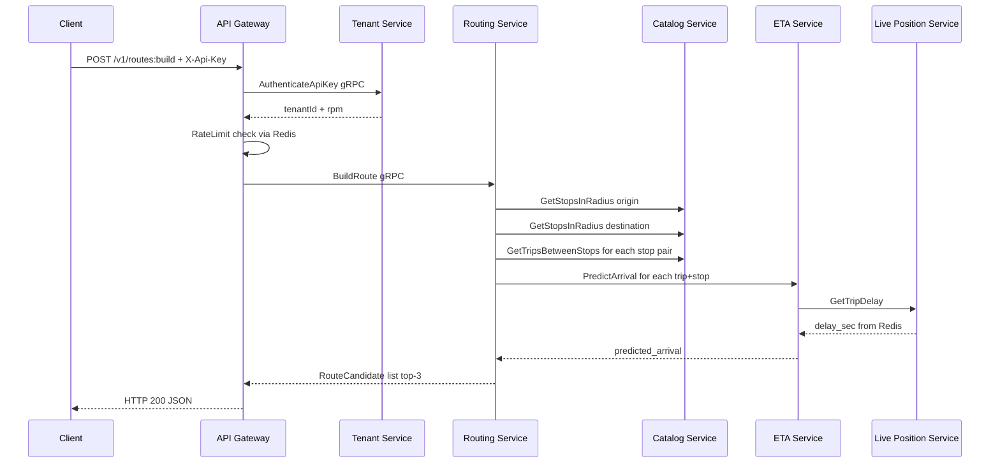
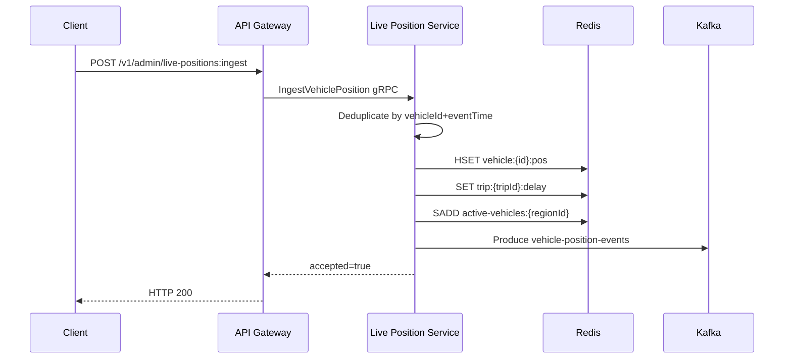
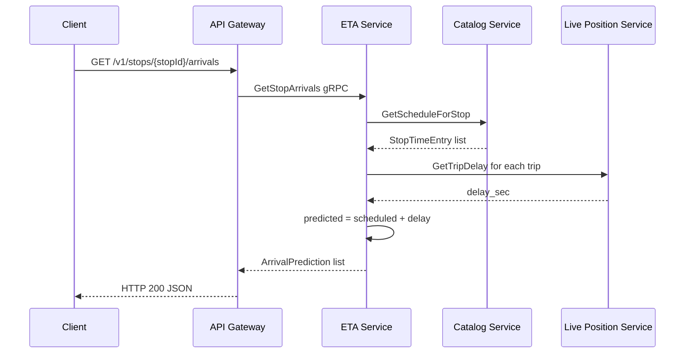

# RouteLab Lite — MVP Architecture (1 week)

## Принцип: делаем только то, что работает и демонстрирует идею

---

## Что режем из ТЗ (не успеть за неделю)

| Фича из ТЗ | Решение |
|---|---|
| Kafka consumers, DLQ, logging consumers | Только один producer в live-position-service |
| `route_requests_log`, `eta_predictions_log`, `imports_audit` | Убираем таблицы |
| `RegisterUsage`, `CheckQuota` gRPC методы | Только `AuthenticateApiKey` |
| Redis GEO index для stops | Haversine прямо в MySQL-запросе |
| `BuildAlternativeRoutes` | Только `BuildRoute` |
| Тарифные планы, quota policies | Только rpm rate limit через Redis |
| Graceful shutdown, metrics, tracing | Не делаем |

---

## Stack

| Компонент | Технология |
|---|---|
| REST API | Pekko HTTP |
| Эффекты | ZIO 2.x |
| Inter-service | gRPC (ScalaPB) |
| БД | MySQL 8 |
| Live state + rate limit | Redis |
| Async events | Kafka (только producer, 1 topic) |
| Сборка | SBT multi-project |
| Локальный запуск | Docker Compose |

---

## 1. Структура проекта

```
routelab/
├── docker-compose.yml
├── build.sbt                        # root multi-project
├── project/
│   ├── build.properties
│   └── plugins.sbt                  # sbt-protoc
├── proto/                           # .proto файлы (shared)
│   ├── tenant.proto
│   ├── transit_catalog.proto
│   ├── live_position.proto
│   ├── eta.proto
│   └── routing.proto
├── shared/                          # общие domain types + utils
│   └── src/main/scala/routelab/shared/
│       ├── domain/                  # Stop, Trip, Route, etc.
│       └── util/Haversine.scala
├── api-gateway/
│   └── src/main/scala/routelab/gateway/
│       ├── Main.scala
│       ├── HttpServer.scala
│       ├── routes/
│       │   ├── RoutesRoute.scala    # POST /v1/routes:build
│       │   ├── StopsRoute.scala     # GET /v1/stops/{id}/arrivals
│       │   ├── VehiclesRoute.scala  # GET /v1/vehicles/live
│       │   └── AdminRoute.scala     # POST /v1/admin/live-positions:ingest
│       ├── middleware/
│       │   ├── AuthMiddleware.scala
│       │   └── RateLimitMiddleware.scala
│       └── clients/                 # gRPC stub wrappers
│           ├── TenantClient.scala
│           ├── RoutingClient.scala
│           ├── EtaClient.scala
│           └── LivePositionClient.scala
├── tenant-service/
│   └── src/main/scala/routelab/tenant/
│       ├── Main.scala
│       ├── GrpcServer.scala
│       ├── TenantServiceImpl.scala
│       └── repo/
│           ├── TenantRepo.scala
│           └── ApiKeyRepo.scala
├── transit-catalog-service/
│   └── src/main/scala/routelab/catalog/
│       ├── Main.scala
│       ├── GrpcServer.scala
│       ├── TransitCatalogServiceImpl.scala
│       └── repo/
│           ├── StopRepo.scala
│           ├── TripRepo.scala
│           └── StopTimeRepo.scala
├── live-position-service/
│   └── src/main/scala/routelab/liveposition/
│       ├── Main.scala
│       ├── GrpcServer.scala
│       ├── LivePositionServiceImpl.scala
│       ├── state/RedisVehicleState.scala
│       ├── delay/DelayCalculator.scala
│       └── kafka/VehicleEventProducer.scala
├── eta-service/
│   └── src/main/scala/routelab/eta/
│       ├── Main.scala
│       ├── GrpcServer.scala
│       ├── EtaServiceImpl.scala
│       └── predictor/ArrivalPredictor.scala
└── routing-service/
    └── src/main/scala/routelab/routing/
        ├── Main.scala
        ├── GrpcServer.scala
        ├── RoutingServiceImpl.scala
        └── algorithm/
            ├── NearbyStopsFinder.scala
            ├── TripCandidateFinder.scala
            └── RouteCandidateBuilder.scala
```

---

## 2. gRPC Protobuf контракты

### `proto/tenant.proto`

```protobuf
syntax = "proto3";
package routelab.tenant;

service TenantService {
  rpc AuthenticateApiKey (AuthenticateApiKeyRequest) returns (AuthenticateApiKeyResponse);
}

message AuthenticateApiKeyRequest {
  string key_hash = 1;
}

message AuthenticateApiKeyResponse {
  bool   valid     = 1;
  string tenant_id = 2;
  int32  rpm       = 3;
}
```

### `proto/transit_catalog.proto`

```protobuf
syntax = "proto3";
package routelab.catalog;

service TransitCatalogService {
  rpc GetStopsInRadius     (GetStopsInRadiusRequest)     returns (GetStopsInRadiusResponse);
  rpc GetStopById          (GetStopByIdRequest)          returns (Stop);
  rpc GetTripsBetweenStops (GetTripsBetweenStopsRequest) returns (GetTripsBetweenStopsResponse);
  rpc GetScheduleForStop   (GetScheduleForStopRequest)   returns (GetScheduleForStopResponse);
}

message Stop {
  string stop_id   = 1;
  string region_id = 2;
  string name      = 3;
  double lat       = 4;
  double lon       = 5;
}

message TripCandidate {
  string trip_id             = 1;
  string route_id            = 2;
  string route_short_name    = 3;
  string scheduled_departure = 4; // HH:mm:ss
  string scheduled_arrival   = 5;
}

message StopTimeEntry {
  string trip_id             = 1;
  string route_short_name    = 2;
  string scheduled_arrival   = 3; // HH:mm:ss
}

message GetStopsInRadiusRequest  { double lat = 1; double lon = 2; int32 radius_m = 3; string region_id = 4; }
message GetStopsInRadiusResponse { repeated Stop stops = 1; }
message GetStopByIdRequest       { string stop_id = 1; }
message GetTripsBetweenStopsRequest {
  string from_stop_id = 1;
  string to_stop_id   = 2;
  string after_time   = 3; // HH:mm:ss
  string service_day  = 4; // YYYY-MM-DD
  string region_id    = 5;
}
message GetTripsBetweenStopsResponse { repeated TripCandidate trips = 1; }
message GetScheduleForStopRequest    { string stop_id = 1; string service_day = 2; }
message GetScheduleForStopResponse   { repeated StopTimeEntry entries = 1; }
```

### `proto/live_position.proto`

```protobuf
syntax = "proto3";
package routelab.liveposition;

service LivePositionService {
  rpc IngestVehiclePosition (IngestVehiclePositionRequest)  returns (IngestVehiclePositionResponse);
  rpc GetVehiclePosition    (GetVehiclePositionRequest)     returns (VehiclePosition);
  rpc GetTripDelay          (GetTripDelayRequest)           returns (TripDelayState);
  rpc GetActiveVehicles     (GetActiveVehiclesRequest)      returns (GetActiveVehiclesResponse);
}

message VehiclePosition {
  string vehicle_id  = 1;
  string trip_id     = 2;
  double lat         = 3;
  double lon         = 4;
  double speed       = 5;
  string event_time  = 6; // ISO-8601
}

message TripDelayState {
  string trip_id           = 1;
  int32  current_delay_sec = 2;
}

message IngestVehiclePositionRequest  { VehiclePosition position = 1; }
message IngestVehiclePositionResponse { bool accepted = 1; }
message GetVehiclePositionRequest     { string vehicle_id = 1; }
message GetTripDelayRequest           { string trip_id    = 1; }
message GetActiveVehiclesRequest      { string region_id  = 1; }
message GetActiveVehiclesResponse     { repeated VehiclePosition vehicles = 1; }
```

### `proto/eta.proto`

```protobuf
syntax = "proto3";
package routelab.eta;

service EtaService {
  rpc PredictArrival  (PredictArrivalRequest)  returns (PredictArrivalResponse);
  rpc GetStopArrivals (GetStopArrivalsRequest) returns (GetStopArrivalsResponse);
}

message ArrivalPrediction {
  string route_short_name = 1;
  string trip_id          = 2;
  string scheduled_at     = 3; // HH:mm:ss
  string predicted_at     = 4;
  int32  delay_sec        = 5;
}

message PredictArrivalRequest  { string trip_id = 1; string stop_id = 2; string service_day = 3; }
message PredictArrivalResponse { ArrivalPrediction prediction = 1; }
message GetStopArrivalsRequest  { string stop_id = 1; string service_day = 2; }
message GetStopArrivalsResponse { repeated ArrivalPrediction arrivals = 1; }
```

### `proto/routing.proto`

```protobuf
syntax = "proto3";
package routelab.routing;

service RoutingService {
  rpc BuildRoute (BuildRouteRequest) returns (BuildRouteResponse);
}

message LatLon { double lat = 1; double lon = 2; }

message RouteSegment {
  string type       = 1; // WALK | BUS
  int32  eta_sec    = 2;
  string route_name = 3; // только для BUS
  int32  wait_sec   = 4; // только для BUS
}

message RouteCandidate {
  string                route_id           = 1;
  int32                 total_eta_sec      = 2;
  int32                 walking_distance_m = 3;
  repeated RouteSegment segments           = 4;
}

message BuildRouteRequest {
  LatLon origin              = 1;
  LatLon destination         = 2;
  string departure_time      = 3; // HH:mm:ss
  string service_day         = 4; // YYYY-MM-DD
  int32  max_walking_m       = 5;
  string region_id           = 6;
}

message BuildRouteResponse {
  string                 request_id = 1;
  repeated RouteCandidate routes    = 2;
}
```

---

## 3. MySQL DDL

Только нужные таблицы. Без logging-таблиц.

```sql
-- ============================================================
-- SaaS
-- ============================================================
CREATE TABLE tenants (
  id                  VARCHAR(36)  NOT NULL PRIMARY KEY,
  name                VARCHAR(255) NOT NULL,
  status              VARCHAR(20)  NOT NULL DEFAULT 'active',
  requests_per_minute INT          NOT NULL DEFAULT 60,
  created_at          DATETIME     NOT NULL DEFAULT CURRENT_TIMESTAMP
) ENGINE=InnoDB DEFAULT CHARSET=utf8mb4;

CREATE TABLE api_keys (
  id         VARCHAR(36) NOT NULL PRIMARY KEY,
  tenant_id  VARCHAR(36) NOT NULL,
  key_hash   VARCHAR(64) NOT NULL UNIQUE,
  active     TINYINT(1)  NOT NULL DEFAULT 1,
  created_at DATETIME    NOT NULL DEFAULT CURRENT_TIMESTAMP,
  INDEX idx_api_keys_tenant (tenant_id),
  FOREIGN KEY (tenant_id) REFERENCES tenants(id)
) ENGINE=InnoDB DEFAULT CHARSET=utf8mb4;

-- ============================================================
-- Transit static data
-- ============================================================
CREATE TABLE stops (
  id         VARCHAR(36)   NOT NULL PRIMARY KEY,
  region_id  VARCHAR(36)   NOT NULL,
  name       VARCHAR(255)  NOT NULL,
  lat        DECIMAL(10,7) NOT NULL,
  lon        DECIMAL(10,7) NOT NULL,
  INDEX idx_stops_region (region_id),
  INDEX idx_stops_lat_lon (lat, lon)
) ENGINE=InnoDB DEFAULT CHARSET=utf8mb4;

CREATE TABLE routes (
  id             VARCHAR(36) NOT NULL PRIMARY KEY,
  region_id      VARCHAR(36) NOT NULL,
  short_name     VARCHAR(50) NOT NULL,
  transport_type VARCHAR(20) NOT NULL DEFAULT 'BUS',
  active         TINYINT(1)  NOT NULL DEFAULT 1,
  INDEX idx_routes_region (region_id)
) ENGINE=InnoDB DEFAULT CHARSET=utf8mb4;

CREATE TABLE trips (
  id           VARCHAR(36) NOT NULL PRIMARY KEY,
  route_id     VARCHAR(36) NOT NULL,
  service_day  DATE        NOT NULL,
  direction_id TINYINT     NOT NULL DEFAULT 0,
  INDEX idx_trips_route (route_id),
  INDEX idx_trips_service_day (service_day),
  FOREIGN KEY (route_id) REFERENCES routes(id)
) ENGINE=InnoDB DEFAULT CHARSET=utf8mb4;

CREATE TABLE stop_times (
  id                  BIGINT      NOT NULL AUTO_INCREMENT PRIMARY KEY,
  trip_id             VARCHAR(36) NOT NULL,
  stop_id             VARCHAR(36) NOT NULL,
  stop_sequence       INT         NOT NULL,
  scheduled_arrival   TIME        NOT NULL,
  scheduled_departure TIME        NOT NULL,
  INDEX idx_st_trip (trip_id),
  INDEX idx_st_stop (stop_id),
  UNIQUE KEY uq_trip_stop_seq (trip_id, stop_sequence),
  FOREIGN KEY (trip_id) REFERENCES trips(id),
  FOREIGN KEY (stop_id) REFERENCES stops(id)
) ENGINE=InnoDB DEFAULT CHARSET=utf8mb4;
```

---

## 4. Redis — ключи и TTL

| Ключ | Тип | TTL | Назначение |
|---|---|---|---|
| `tenant:{tenantId}:rpm` | String (INCR) | 60 s | Rate limit счётчик |
| `apikey:{keyHash}` | Hash | 300 s | Кэш tenant policy (id, rpm) |
| `vehicle:{vehicleId}:pos` | Hash | 120 s | Последняя позиция vehicle |
| `trip:{tripId}:delay` | String (int) | 120 s | Текущий delay в секундах |
| `active-vehicles:{regionId}` | Set | 120 s | Множество vehicleId активных |

### Rate limiting — алгоритм

```
val count = INCR tenant:{tenantId}:rpm
if count == 1 then EXPIRE tenant:{tenantId}:rpm 60
if count > rpm then reject with 429
```

### Vehicle state — при ingest

```
HSET vehicle:{vehicleId}:pos lat {lat} lon {lon} trip_id {tripId} event_time {ts}
EXPIRE vehicle:{vehicleId}:pos 120

SET trip:{tripId}:delay {delaySec}
EXPIRE trip:{tripId}:delay 120

SADD active-vehicles:{regionId} {vehicleId}
EXPIRE active-vehicles:{regionId} 120
```

---

## 5. Kafka

Только один topic, только producer.

| Topic | Partitions | Producer | Consumer |
|---|---|---|---|
| `vehicle-position-events` | 4 | live-position-service | — (не делаем) |

### Event schema (circe JSON)

```scala
case class VehiclePositionEvent(
  vehicleId: String,
  tripId:    String,
  lat:       Double,
  lon:       Double,
  speed:     Double,
  eventTime: String  // ISO-8601
)
```

Ключ сообщения: `vehicleId` — для партиционирования по vehicle.

---

## 6. Data Flow диаграммы

### 6.1. POST /v1/routes:build



### 6.2. POST /v1/admin/live-positions:ingest



### 6.3. GET /v1/stops/{stopId}/arrivals



---

## 7. ZIO Layer wiring — паттерн для каждого сервиса

Каждый сервис — одна точка входа [`Main.scala`](routelab/routing-service/src/main/scala/routelab/routing/Main.scala):

```scala
object Main extends ZIOAppDefault {
  override def run: ZIO[Any, Throwable, Unit] =
    ZIO.scoped {
      program.provide(
        AppConfig.live,          // читает env vars
        MySqlTransactor.live,    // HikariCP pool
        StopRepo.live,
        TripRepo.live,
        StopTimeRepo.live,
        TransitCatalogServiceImpl.live,
        GrpcServer.live          // запускает gRPC на порту из config
      )
    }

  val program: ZIO[GrpcServer, Throwable, Unit] =
    ZIO.serviceWithZIO[GrpcServer](_.awaitTermination)
}
```

### Слои — правило зависимостей

```
AppConfig.live
    └── MySqlTransactor.live
            └── StopRepo.live
            └── TripRepo.live
            └── StopTimeRepo.live
                    └── TransitCatalogServiceImpl.live
                                └── GrpcServer.live
```

### gRPC Server — ZIO resource

```scala
object GrpcServer {
  trait Service { def awaitTermination: UIO[Unit] }

  val live: ZLayer[TransitCatalogServiceImpl with AppConfig, Throwable, GrpcServer] =
    ZLayer.scoped {
      for {
        impl   <- ZIO.service[TransitCatalogServiceImpl]
        config <- ZIO.service[AppConfig]
        server <- ZIO.acquireRelease(
                    ZIO.attempt {
                      ServerBuilder
                        .forPort(config.grpcPort)
                        .addService(TransitCatalogServiceGrpc.bindService(impl, ExecutionContext.global))
                        .build()
                        .start()
                    }
                  )(s => ZIO.attempt(s.shutdown()).orDie)
      } yield new Service {
        def awaitTermination: UIO[Unit] =
          ZIO.attempt(server.awaitTermination()).orDie
      }
    }
}
```

### Pekko HTTP в API Gateway — bridge ZIO ↔ Future

```scala
// В HttpServer.scala
val live: ZLayer[...deps..., Throwable, Unit] =
  ZLayer.scoped {
    for {
      runtime <- ZIO.runtime[...deps...]
      routes   = buildRoutes(using runtime)  // implicit runtime для unsafeRun
      binding <- ZIO.acquireRelease(
                   ZIO.fromFuture(_ =>
                     Http()(ActorSystem("gateway"))
                       .newServerAt("0.0.0.0", config.httpPort)
                       .bind(routes)
                   )
                 )(b => ZIO.fromFuture(_ => b.unbind()).orDie)
      _       <- ZIO.never
    } yield ()
  }
```

---

## 8. Алгоритмы MVP

### 8.1. Ближайшие остановки — Haversine в MySQL

```sql
SELECT id, name, lat, lon,
  (6371000 * ACOS(
    LEAST(1.0,
      COS(RADIANS(:lat)) * COS(RADIANS(lat)) *
      COS(RADIANS(lon) - RADIANS(:lon)) +
      SIN(RADIANS(:lat)) * SIN(RADIANS(lat))
    )
  )) AS distance_m
FROM stops
WHERE region_id = :regionId
HAVING distance_m <= :radiusM
ORDER BY distance_m
LIMIT 10;
```

### 8.2. Поиск trip между двумя остановками

```sql
SELECT
  t.id            AS trip_id,
  r.id            AS route_id,
  r.short_name,
  st_a.scheduled_departure,
  st_b.scheduled_arrival
FROM trips t
JOIN routes r       ON r.id = t.route_id
JOIN stop_times st_a ON st_a.trip_id = t.id AND st_a.stop_id = :fromStopId
JOIN stop_times st_b ON st_b.trip_id = t.id AND st_b.stop_id = :toStopId
WHERE t.service_day = :serviceDay
  AND r.region_id   = :regionId
  AND st_a.stop_sequence < st_b.stop_sequence
  AND st_a.scheduled_departure >= :afterTime
ORDER BY st_a.scheduled_departure
LIMIT 5;
```

### 8.3. Пеший ETA

```scala
object Haversine {
  val WalkingSpeedMs = 1.4 // м/с

  def distanceM(lat1: Double, lon1: Double, lat2: Double, lon2: Double): Double = {
    val R = 6371000.0
    val dLat = math.toRadians(lat2 - lat1)
    val dLon = math.toRadians(lon2 - lon1)
    val a = math.sin(dLat/2) * math.sin(dLat/2) +
            math.cos(math.toRadians(lat1)) * math.cos(math.toRadians(lat2)) *
            math.sin(dLon/2) * math.sin(dLon/2)
    R * 2 * math.atan2(math.sqrt(a), math.sqrt(1-a))
  }

  def walkEtaSec(distM: Double): Int = (distM / WalkingSpeedMs).toInt
}
```

### 8.4. ETA прибытия

```scala
// В ArrivalPredictor
def predict(scheduledArrival: LocalTime, delaySec: Int): LocalTime =
  scheduledArrival.plusSeconds(delaySec)
```

### 8.5. Сборка маршрута

```scala
// В RouteCandidateBuilder
// Для каждой пары (originStop, destStop, trip):
val walkToStop   = Haversine.walkEtaSec(distOriginToStop)
val waitForBus   = secondsBetween(now, trip.scheduledDeparture)
val busEta       = secondsBetween(trip.scheduledDeparture, predictedArrival)
val walkFromStop  = Haversine.walkEtaSec(distDestStopToDest)
val totalEta     = walkToStop + waitForBus + busEta + walkFromStop

// Сортировка: по totalEta, top-3
```

---

## 9. Порты сервисов

| Сервис | HTTP | gRPC |
|---|---|---|
| api-gateway | 8080 | — |
| tenant-service | — | 9091 |
| transit-catalog-service | — | 9092 |
| live-position-service | — | 9093 |
| eta-service | — | 9094 |
| routing-service | — | 9095 |

---

## 10. Docker Compose (минимальный)

```yaml
version: "3.9"
services:
  mysql:
    image: mysql:8
    environment:
      MYSQL_ROOT_PASSWORD: root
      MYSQL_DATABASE: routelab
    ports: ["3306:3306"]
    volumes: ["./infra/init.sql:/docker-entrypoint-initdb.d/init.sql"]

  redis:
    image: redis:7-alpine
    ports: ["6379:6379"]

  kafka:
    image: confluentinc/cp-kafka:7.6.0
    environment:
      KAFKA_NODE_ID: 1
      KAFKA_PROCESS_ROLES: broker,controller
      KAFKA_LISTENERS: PLAINTEXT://0.0.0.0:9092,CONTROLLER://0.0.0.0:9093
      KAFKA_ADVERTISED_LISTENERS: PLAINTEXT://kafka:9092
      KAFKA_CONTROLLER_QUORUM_VOTERS: 1@kafka:9093
      KAFKA_CONTROLLER_LISTENER_NAMES: CONTROLLER
      KAFKA_OFFSETS_TOPIC_REPLICATION_FACTOR: 1
      CLUSTER_ID: "routelab-cluster-1"
    ports: ["9092:9092"]

  tenant-service:
    build: ./tenant-service
    environment:
      DB_URL: jdbc:mysql://mysql:3306/routelab
      DB_USER: root
      DB_PASSWORD: root
      GRPC_PORT: 9091
    ports: ["9091:9091"]
    depends_on: [mysql]

  transit-catalog-service:
    build: ./transit-catalog-service
    environment:
      DB_URL: jdbc:mysql://mysql:3306/routelab
      DB_USER: root
      DB_PASSWORD: root
      GRPC_PORT: 9092
    ports: ["9092:9092"]
    depends_on: [mysql]

  live-position-service:
    build: ./live-position-service
    environment:
      REDIS_HOST: redis
      REDIS_PORT: 6379
      KAFKA_BOOTSTRAP: kafka:9092
      GRPC_PORT: 9093
    ports: ["9093:9093"]
    depends_on: [redis, kafka]

  eta-service:
    build: ./eta-service
    environment:
      CATALOG_GRPC_HOST: transit-catalog-service
      CATALOG_GRPC_PORT: 9092
      LIVE_GRPC_HOST: live-position-service
      LIVE_GRPC_PORT: 9093
      GRPC_PORT: 9094
    ports: ["9094:9094"]
    depends_on: [transit-catalog-service, live-position-service]

  routing-service:
    build: ./routing-service
    environment:
      CATALOG_GRPC_HOST: transit-catalog-service
      CATALOG_GRPC_PORT: 9092
      ETA_GRPC_HOST: eta-service
      ETA_GRPC_PORT: 9094
      GRPC_PORT: 9095
    ports: ["9095:9095"]
    depends_on: [transit-catalog-service, eta-service]

  api-gateway:
    build: ./api-gateway
    environment:
      HTTP_PORT: 8080
      REDIS_HOST: redis
      REDIS_PORT: 6379
      TENANT_GRPC_HOST: tenant-service
      TENANT_GRPC_PORT: 9091
      ROUTING_GRPC_HOST: routing-service
      ROUTING_GRPC_PORT: 9095
      ETA_GRPC_HOST: eta-service
      ETA_GRPC_PORT: 9094
      LIVE_GRPC_HOST: live-position-service
      LIVE_GRPC_PORT: 9093
    ports: ["8080:8080"]
    depends_on: [tenant-service, routing-service, eta-service, live-position-service]
```

---

## 11. Порядок реализации за неделю

### День 1–2: Фундамент
- [ ] SBT multi-project build + proto codegen (sbt-protoc)
- [ ] Docker Compose с MySQL, Redis, Kafka
- [ ] MySQL schema (`infra/init.sql`)
- [ ] `shared` модуль: domain types + Haversine
- [ ] `tenant-service`: AuthenticateApiKey gRPC + MySQL repo

### День 3: Catalog
- [ ] `transit-catalog-service`: все 4 gRPC метода
- [ ] SQL запросы: stops in radius, trips between stops
- [ ] Seed-скрипт: 30 stops, 5 routes, 50 trips, stop_times

### День 4: Live Position + Kafka
- [ ] `live-position-service`: IngestVehiclePosition gRPC
- [ ] Redis state: vehicle position + trip delay + active-vehicles set
- [ ] Kafka producer: `vehicle-position-events`
- [ ] GetVehiclePosition, GetTripDelay, GetActiveVehicles gRPC

### День 5: ETA + Routing
- [ ] `eta-service`: GetStopArrivals + PredictArrival gRPC
- [ ] `routing-service`: BuildRoute gRPC
- [ ] Алгоритм: NearbyStops → TripCandidates → ETA → top-3 sort

### День 6: API Gateway
- [ ] Pekko HTTP сервер: все 5 REST endpoints
- [ ] AuthMiddleware: X-Api-Key → gRPC AuthenticateApiKey → кэш в Redis
- [ ] RateLimitMiddleware: INCR/EXPIRE в Redis
- [ ] Проксирование во внутренние gRPC сервисы

### День 7: Интеграция + README
- [ ] End-to-end тест: import data → ingest positions → build route → arrivals
- [ ] `docker-compose up` — всё поднимается
- [ ] README: как запустить, как импортировать данные, curl-примеры

---

## 12. SBT build.sbt (скелет)

```scala
// build.sbt
val zioVersion      = "2.1.6"
val pekkoVersion    = "1.0.3"
val scalaPbVersion  = "0.11.17"
val grpcVersion     = "1.64.0"
val doobieVersion   = "1.0.0-RC5"
val redis4catsVersion = "1.7.1"
val fs2KafkaVersion = "3.5.1"
val circeVersion    = "0.14.9"

lazy val commonSettings = Seq(
  scalaVersion := "2.13.14",
  organization := "routelab",
  scalacOptions ++= Seq("-Xsource:3", "-deprecation", "-feature")
)

lazy val commonDeps = Seq(
  "dev.zio"       %% "zio"         % zioVersion,
  "dev.zio"       %% "zio-streams" % zioVersion,
  "io.circe"      %% "circe-core"  % circeVersion,
  "io.circe"      %% "circe-generic" % circeVersion,
  "io.circe"      %% "circe-parser"  % circeVersion
)

lazy val grpcDeps = Seq(
  "com.thesamet.scalapb" %% "scalapb-runtime-grpc" % scalaPbVersion,
  "io.grpc"               % "grpc-netty"            % grpcVersion
)

lazy val dbDeps = Seq(
  "org.tpolecat" %% "doobie-core"   % doobieVersion,
  "org.tpolecat" %% "doobie-hikari" % doobieVersion,
  "mysql"         % "mysql-connector-java" % "8.0.33"
)

lazy val redisDeps = Seq(
  "dev.profunktor" %% "redis4cats-effects" % redis4catsVersion,
  "dev.profunktor" %% "redis4cats-log4cats" % redis4catsVersion
)

lazy val kafkaDeps = Seq(
  "com.github.fd4s" %% "fs2-kafka" % fs2KafkaVersion
)

lazy val shared = project
  .settings(commonSettings)
  .settings(libraryDependencies ++= commonDeps)

lazy val proto = project
  .settings(commonSettings)
  .settings(
    libraryDependencies ++= grpcDeps,
    Compile / PB.targets := Seq(
      scalapb.gen(grpc = true) -> (Compile / sourceManaged).value / "scalapb"
    )
  )

lazy val tenantService = project.in(file("tenant-service"))
  .dependsOn(shared, proto)
  .settings(commonSettings)
  .settings(libraryDependencies ++= commonDeps ++ grpcDeps ++ dbDeps)

lazy val transitCatalogService = project.in(file("transit-catalog-service"))
  .dependsOn(shared, proto)
  .settings(commonSettings)
  .settings(libraryDependencies ++= commonDeps ++ grpcDeps ++ dbDeps ++ redisDeps)

lazy val livePositionService = project.in(file("live-position-service"))
  .dependsOn(shared, proto)
  .settings(commonSettings)
  .settings(libraryDependencies ++= commonDeps ++ grpcDeps ++ redisDeps ++ kafkaDeps)

lazy val etaService = project.in(file("eta-service"))
  .dependsOn(shared, proto)
  .settings(commonSettings)
  .settings(libraryDependencies ++= commonDeps ++ grpcDeps)

lazy val routingService = project.in(file("routing-service"))
  .dependsOn(shared, proto)
  .settings(commonSettings)
  .settings(libraryDependencies ++= commonDeps ++ grpcDeps)

lazy val apiGateway = project.in(file("api-gateway"))
  .dependsOn(shared, proto)
  .settings(commonSettings)
  .settings(
    libraryDependencies ++= commonDeps ++ grpcDeps ++ redisDeps ++ Seq(
      "org.apache.pekko" %% "pekko-http"       % pekkoVersion,
      "org.apache.pekko" %% "pekko-http-spray-json" % pekkoVersion,
      "org.apache.pekko" %% "pekko-actor-typed" % "1.0.3"
    )
  )

lazy val root = project.in(file("."))
  .aggregate(shared, proto, tenantService, transitCatalogService,
             livePositionService, etaService, routingService, apiGateway)
```

### `project/plugins.sbt`

```scala
addSbtPlugin("com.thesamet" % "sbt-protoc" % "1.0.7")
libraryDependencies += "com.thesamet.scalapb" %% "compilerplugin" % "0.11.17"
```

---

## 13. Что НЕ делаем в MVP (явный список)

- ❌ Kafka consumers и DLQ
- ❌ Logging таблицы в MySQL
- ❌ Quota / RegisterUsage
- ❌ Redis GEO (используем Haversine в SQL)
- ❌ BuildAlternativeRoutes
- ❌ Тарифные планы
- ❌ Metrics / tracing
- ❌ Unit тесты (только e2e через curl)
- ❌ Graceful shutdown
- ❌ TLS для gRPC

Всё это можно добавить после MVP как отдельные итерации.